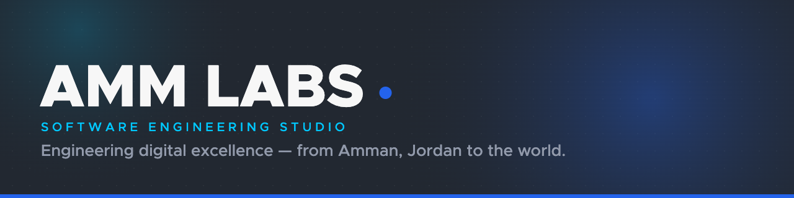

 

 

## About us

AMM Labs is a full-service software engineering studio operating globally from Amman, Jordan. We build robust digital foundations for founders, product teams, and CTOs — production-ready, battle-tested, and deployed with zero surprises.

We engineer systems that scale, from your first user to your millionth.

 

## Services

| Service | Description |
|---|---|
| **Web Application Development** | Full-stack, high-performance, scalable web platforms. |
| **Mobile Application Development** | Native and cross-platform iOS/Android apps. |
| **E-commerce Solutions** | High-converting digital storefronts. |
| **Quality Control & Assurance** | Automated and manual testing, security audits. |

**Expanding into:** SaaS architecture, DevOps/cloud infrastructure, UI/UX product design, and dedicated team augmentation.

 

## Tech stack

`TypeScript` `React` `Next.js` `Node.js` `PostgreSQL` `Docker` `AWS` `REST API` `CI/CD`

We pick tools for reliability and fit, not hype — and we hold ourselves to the same engineering bar we hold our clients' systems to.

 

## Join us

We're growing our team of engineers, designers, and QA specialists in Amman and beyond. If you care about craft as much as we do, get in touch.

[**View open roles → amm-labs.com/careers**](http://amm-labs.com/)

 

## Get in touch

- 🌐 [amm-labs.com](http://amm-labs.com/)
- 💼 [LinkedIn](https://www.linkedin.com/company/ammlabs/)
- 📸 [Instagram](https://www.instagram.com/amm.labs/)
- 📘 [Facebook](https://www.facebook.com/ammlabs)

 

© 2026 AMM Labs — Amman, Jordan

